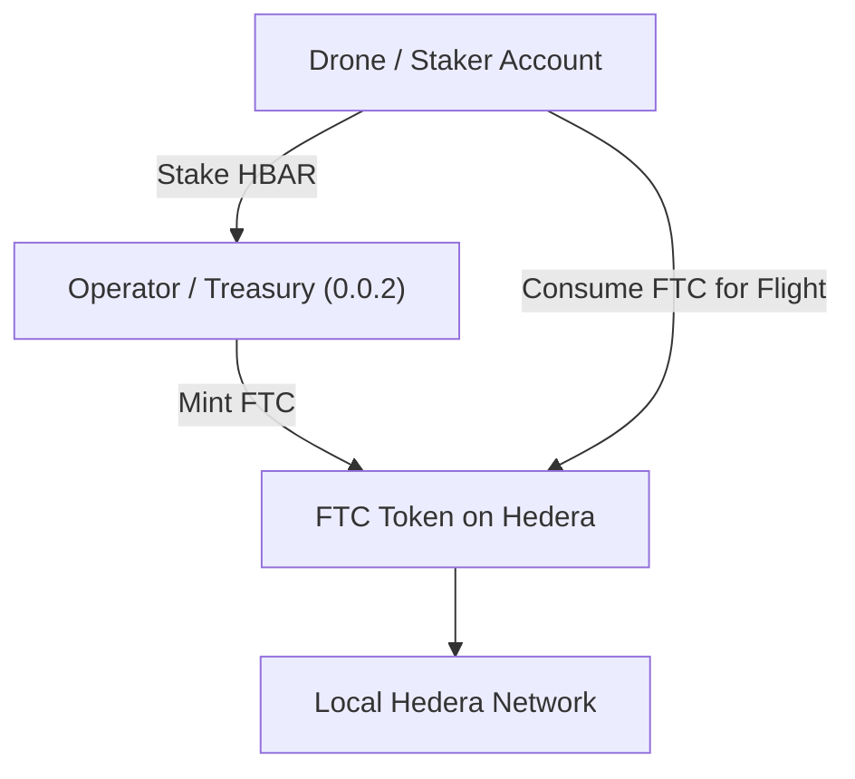

# ✈️ Drone Consensus Blockchain

This project demonstrates the evolution of a **drone flight-plan consensus network** —  
starting with a simple mock blockchain and extending into a **local Hedera Hashgraph** deployment  
with staking and tokenized **Flight Throughput Credits (FTCs)**.

---

## 🧩 Overview

### Phase 1 — Mock Blockchain Prototype
A Python REST API that:
- Accepts JSON flight-plan submissions.
- Validates conflicts in time windows.
- Reaches consensus (APPROVED / DENIED).
- Maintains an in-memory blockchain ledger.

### Phase 2 — Local Hedera Hashgraph Integration
We extend the prototype to a real distributed-ledger environment:
- Runs a **local Hedera Hashgraph node** using Docker.
- Uses **Hedera SDK** scripts to create accounts, mint fungible tokens, and simulate staking.
- Introduces **Flight Throughput Credits (FTC)** — on-ledger tokens representing flight-plan throughput capacity earned through stake.

---

## 🚀 Features
- 🛰 Submit flight plans and detect scheduling conflicts.
- 💾 Blockchain-style immutable record of approvals.
- ⚖️ Local Hedera Hashgraph network with real transactions.
- 💰 Stake → Mint → Transfer → Consume Flight Throughput Credits.
- 🧠 **NEW: Hedera Consensus Service (HCS) integration for real consensus**
- 🔄 **NEW: Real-time conflict detection with message consumption**
- 🎯 **NEW: Hybrid API supporting both Hedera and mock blockchain**
- 📊 **NEW: Complete end-to-end testing and automation**

---

## 🆕 **NEW: Hedera Consensus Service Integration**

### **Phase 3 — Real Blockchain Consensus** ✅

The project now includes **complete Hedera Hashgraph integration**:

- **Hedera Consensus Service (HCS)** for real distributed consensus
- **Real-time message consumption** with conflict detection
- **FTC token economy** with automatic payment processing
- **Hybrid architecture** supporting both Hedera and mock blockchain
- **Complete automation** with setup scripts and testing

### **New Files Added:**
- `hedera_flight_api.py` - Enhanced Flask API with Hedera integration
- `hedera-scripts/setup_environment.js` - One-click environment setup
- `hedera-scripts/submit_flightplan.js` - Flight plan submission with FTC payment
- `hedera-scripts/consume_flightplans.js` - Real-time conflict detection
- `test_flight_workflow.sh` - Complete end-to-end testing
- `README_HEDERA_INTEGRATION.md` - Detailed integration documentation

### **Quick Start with Hedera:**
```bash
# 1. Setup environment (creates accounts, tokens, topics)
cd hedera-scripts && node setup_environment.js

# 2. Test flight plan submission
node submit_flightplan.js

# 3. Start message consumer for conflict detection
node consume_flightplans.js

# 4. Run integrated API
python hedera_flight_api.py
```

---

## ⚙️ Setup

### 1. Clone the Repository
```bash
git clone https://github.com/bennettdavisv1/drone-consensus-blockchain.git
cd drone-consensus-blockchain
```

### 2. Initialize the Hedera Submodule (if used)

```bash
git submodule update --init --recursive
```

### 3. Start the Local Hedera Node

```bash
cd hedera-local-node
docker compose up -d
```

### 4. Install SDK Dependencies

```bash
cd ../hedera-scripts
npm install
```

---

## ▶️ Run the Hedera SDK Scripts

### Verify Node Connectivity

```bash
node connect_test.js
```

**Expected Output:**

✅ Connected to local Hedera node successfully!

---

### Create a Staker Account

```bash
node create_account.js
```

**Expected Output:**

```
✅ New account created! ID: 0.0.1002
💰 Account balance: 100 ℏ
```

### Mint Flight Throughput Credits (FTC)

```bash
node mint_ftc.js
```

**Expected Output:**

```
🏦 Using treasury account: 0.0.2
✅ FTC token created! Token ID: 0.0.1007
✅ Associated staker account (0.0.1002) with token 0.0.1007
✅ 100 FTCs minted.
✅ 100 FTCs transferred to 0.0.1002
📊 Final balances:
   Treasury: 0 FTC
   Staker: 100 FTC
🎉 Flight Throughput Credit minting complete!
```

---

## 🧠 Architecture



---

## 🧱 Project Structure

```
drone-consensus-blockchain/
│
├── hedera-scripts/          # Node.js scripts interacting with Hedera
│   ├── connect_test.js
│   ├── create_account.js
│   ├── mint_ftc.js
│   ├── package.json
│   └── package-lock.json
│
├── hedera-local-node/       # (Optional) Local Hedera node via Docker submodule
│
├── blockchain.py            # Mock blockchain logic (Phase 1)
├── app.py                   # REST API for flight-plan submission
├── README.md
└── .gitignore
```

---

## 🧭 Roadmap

| Phase | Description                                              | Status     |
| ----- | -------------------------------------------------------- | ---------- |
| 1     | Mock blockchain API for flight-plan consensus            | ✅ Complete |
| 2     | Local Hedera setup + FTC token economy                   | ✅ Complete |
| 3     | **Hedera Consensus Service (HCS) integration**         | ✅ **Complete** |
| 4     | **Real-time conflict detection & consensus**             | ✅ **Complete** |
| 5     | **Hybrid API with Hedera + fallback**                   | ✅ **Complete** |
| 6     | Dynamic FTC minting based on stake balances              | 🔜 Next     |
| 7     | Dashboard + map visualization for flight plans           | 🧩 Future   |

---

## ⚠️ Security Note

Do **not** commit private keys to public repositories.

Use a `.env` file to securely store your Hedera account IDs and private keys:

```
OPERATOR_ID=0.0.2
OPERATOR_KEY=302e020100...
STAKER_ID=0.0.1002
STAKER_KEY=302e020100...
```

Then load them in your Node scripts using `dotenv`:

```bash
npm install dotenv
```

And at the top of each script:

```javascript
import dotenv from "dotenv";
dotenv.config();
```

---

## 🧰 Running the Mock Blockchain (Phase 1)

If you’d like to run the original Python prototype:

### Setup Python Environment

```bash
python3 -m venv venv
source venv/bin/activate   # macOS/Linux
venv\Scripts\activate      # Windows
pip install -r requirements.txt
```

### Run Server

```bash
python app.py
```

### Test API

```bash
curl -X POST http://127.0.0.1:8000/flightplan \
  -H "Content-Type: application/json" \
  -d '{
        "droneId": "drone123",
        "start": "2025-10-02T14:00:00Z",
        "end": "2025-10-02T14:30:00Z",
        "path": [[36.12, -86.67], [36.15, -86.70]]
      }'
```

---

## 🧭 Future Vision

* Use Hedera Consensus Service (HCS) to reach multi-node agreement on flight approvals.
* Implement geographic overlap detection (spatial conflicts).
* Introduce a real-time dashboard for visualizing flight paths and ledger state.
* Add smart contract-based staking for autonomous credit issuance.

---

## 📜 License

**MIT License** — free for research and development.
